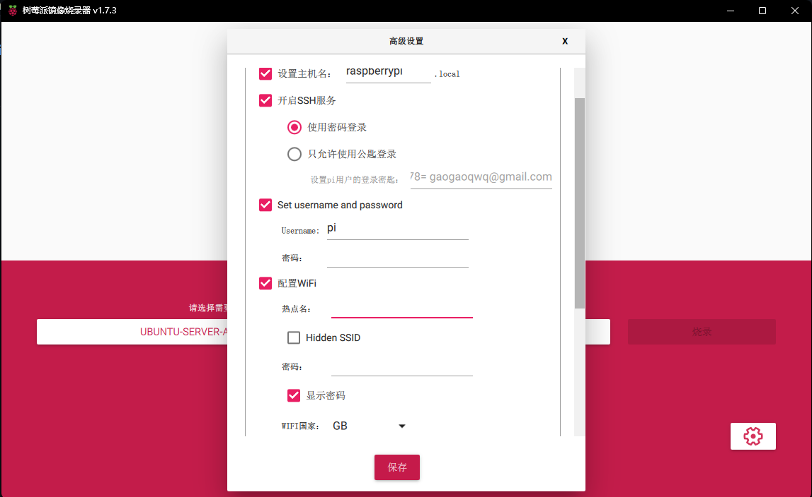
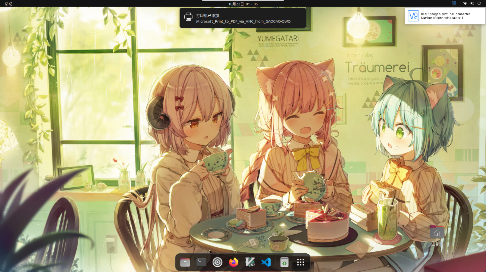

# Ubuntu on Raspberry Pi 4 type-c 一线连解决方案

> 

> 其实在很早就有人发现可以让树莓派4通过一条 type-c 线将 iPad 和树莓派置于同一局域网下了，如果没记错的话大概是 [这篇文章](https://www.hardill.me.uk/wordpress/2019/11/02/pi4-usb-c-gadget/)，也有人基于这篇文章做了个视频[视频链接](https://youtu.be/A3qn1nqw-Gw/)。
> 
> 国内也有人制作了 [一键式 .sh 脚本](https://github.com/TANG617/RaspberryPi-One-Wire) 和视频
> [视频链接](https://www.bilibili.com/video/BV1Au41197TT?share_source=copy_web&vd_source=3dfe10e0ea7d375042c58f23282c5c53)。

**但这些都是针对树莓派官方提供的系统的解决方案，那么有没有一种针对 Ubuntu 的 type-c 一线连解决方案呢？**

## 刷入镜像

其实也是有的，在 [这个仓库](https://github.com/techcraftco/rpi-usb-gadget) 中其实已经有人帮我们做了一个配置好 type-c otg 的树莓派 Ubuntu Server 镜像，只需要进入该仓库的 [Release](https://github.com/techcraftco/rpi-usb-gadget/releases) 页面即可获取，接下来只需要走一遍已经刻入 DNA 里的刷入树莓派镜像流程即可，不过需要注意的是，如果对 linux 不是很熟悉，可以先在官方提供的工具中先把 Wi-Fi 连上，省的还要在终端里自己写配置文件。



安装完后通过你能想到的任何方式（ssh, HDMI, etc.）进入终端，开始桌面环境的安装（如果你习惯不装桌面，那你已经可以靠自己解决接下来的所有问题了。）

---

## 桌面环境安装

首先换源，用你想用的编辑器打开或者直接用 linux 文件编辑指令都可以

```
sudo nano /etc/apt/sources.list
```

这里我用的是中科大源，直接把所有的地址改成中科大的即可，没什么难度

```
https://mirrors.ustc.edu.cn/ubuntu-ports/
```

然后是每个 linux 开箱后的传统两部曲

```
sudo apt update && sudo apt upgrade
```

然后装个你想用的 display manager，这里我装的是 lightdm

```
sudo apt install lightdm
```

输入以下指令，然后去泡杯茶吧等着吧（

```
sudo apt install ubuntu-desktop
```

但是如果就这样重启后进入桌面，会惊讶地发现 Wi-Fi 不可用，其实这很正常，因为我们装的是 Ubuntu Server，网络会默认由 netplan 控制。所以我们需要在重启之前，用任意你喜欢的文本编辑器打开 `/etc/netplan/50-cloud-init.yaml`

```
sudo nano /etc/netplan/50-cloud-init.yaml
```

这里面存储的就是你在刷入镜像时在设置界面填写的你的 Wi-Fi SSID 和密码，我们只需要吧这些全部注释掉后重启系统即可在桌面中随意切换 Wi-Fi 啦~

```
# This file is generated from information provided by the datasource.  Changes
# to it will not persist across an instance reboot.  To disable cloud-init's
# network configuration capabilities, write a file
# /etc/cloud/cloud.cfg.d/99-disable-network-config.cfg with the following:
# network: {config: disabled}
#network:
#    version: 2
#    wifis:
#        renderer: networkd
#        wlan0:
#            access-points:
#                这里是Wi-Fi的SSID:
#                    password: 这里是Wi-Fi的密码
#            dhcp4: true
#            optional: true
```

然后，只需要执行 `sudo reboot` 重启系统即可进入桌面啦~

至此，只使用 HDMI 的 Ubuntu 桌面配置到此结束了，但这可是 type-c 一线连的教程，我们的目标是能够实现 iPad 通过 VNC 连接至树莓派桌面，所以请继续往下阅读 VNC 方案

---

## VNC Server 安装

在安装 VNC Server 之前，首先需要更改一下树莓派的配置文件，打开如下文件，当然你也可以用读卡器在其他系统下直接更改sd卡下的 config.txt 文件

```
sudo nano /boot/firmware/config.txt
```

在文件的最末添加如下三行即可，其中 `framebuffer_width` 和 `framebuffer_height` 可以更改为你想要的分辨率来适配各种设备，`hdmi_force_hotplug` 让树莓派可以实现 HDMI 热插拔，只有打开才能实现我们想要的 headless。

```
hdmi_force_hotplug=1
framebuffer_width=1920
framebuffer_height=1080
```

更改完毕后开始进行 VNC Server 的安装，这里我选用的是 RealVNC 的方案，你可以到官网下到树莓派 arm64 的 .deb，或者也可以到树莓派镜像源获取。

```
# RealVNC 官网源
wget https://downloads.realvnc.com/download/file/vnc.files/vnc-Server-6.11.0-Linux-ARM64.deb
# 树莓派镜像源
wget https://archive.raspberrypi.org/debian/pool/main/r/realvnc-vnc/realvnc-vnc-viewer_6.22.515.47347_arm64.deb
```

下好后直接 `dpkg -i` 安装即可

```
sudo dpkg -i 文件名.deb
```

接着，我们 cd 到 /usr/lib/aarch64-linux-gnu

```
cd /usr/lib/aarch64-linux-gnu
```

执行如下指令

```
sudo ln libvcos.so /usr/lib/libvcos.so.0
sudo ln libvchiq_arm.so /usr/lib/libvchiq_arm.so.0
sudo ln libbcm_host.so /usr/lib/libbcm_host.so.0
sudo ln libmmal.so /usr/lib/libmmal.so.0
sudo ln libmmal_core.so /usr/lib/libmmal_core.so.0
sudo ln libmmal_components.so /usr/lib/libmmal_components.so.0
sudo ln libmmal_util.so /usr/lib/libmmal_util.so.0
sudo ln libmmal_vc_client.so /usr/lib/libmmal_vc_client.so.0
sudo ln libvcsm.so /usr/lib/libvcsm.so.0
sudo ln libcontainers.so /usr/lib/libcontainers.so.0
```

最后，启用并启动一下 VNC Server 服务

```
sudo systemctl enable vncserver-virtuald.service
sudo systemctl enable vncserver-x11-serviced.service
sudo systemctl start vncserver-virtuald.service
sudo systemctl start vncserver-x11-serviced.service
```

重启系统即可通过 VNC 连接至树莓派啦，让我们分别试试通过 Wi-Fi 的 VNC 远程连接和直接使用 type-c 一线连后通过 iPad VNC 连接至树莓派



需要注意的一点是 iPad 通过 type-c 连接上树莓派后会在设置中多出来一个 “以太网” 选项，如果点进去后能看到 IP 地址则说明配置成功，只需要在任意 VNC 客户端中输入地址 `10.55.0.1` 即可连接，如果没有看到 “以太网” 选项，那你应该重新阅读此文，检查是否有什么地方有所疏漏（或者本篇文章有什么地方有所疏漏）。若果你已经看到以太网选项但是一段时间后该选项自动消失了，那你应该试试用上面的指令重新启用 VNC Server 服务，重启然后重新连接 iPad。


